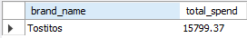
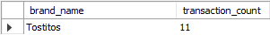
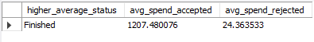
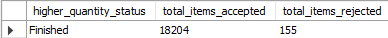

# Fetch Rewards Coding Exercise - Analytics Engineer

## Project Overview:
This project contains the solution to the Fetch Rewards Coding Exercise. It includes SQL queries to answer business questions, data quality analysis, and a relational data model for better structuring the provided datasets.

## Project Structure:
- **/queries/**: Contains SQL queries to answer the business questions.
  - `query.sql`: 
    - Which brand has the most spend among users who were created within the past 6 months?
      
    - Which brand has the most transactions among users who were created within the past 6 months?
      
    - Average spend from receipts with 'rewardsReceiptStatus’ of ‘Accepted’ or ‘Rejected’
      
    - Total number of items purchased from receipts with 'rewardsReceiptStatus’ of ‘Accepted’ or ‘Rejected’
      

- **/scripts/**: Contains the Python script for data quality checks.
  - `data_quality_check_notebook.ipynb`: Jupyter notebook that checks for missing values, invalid data types, future dates, and duplicate records.

- **/documentation/**: Contains supporting documentation.
  - `data_model_diagram.png`: A relational data model diagram.
  - `schema_details`: A summary of the data quality findings.
  - `communication_draft_email`: A draft email communicating data quality issues.

