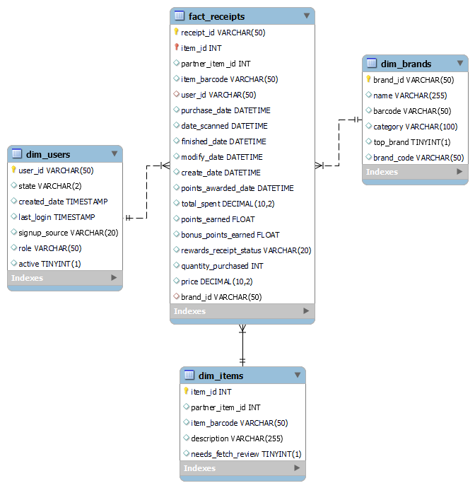

# Data Warehouse Schema Description

## Schema Overview

1. **Fact_Receipts**: The central fact table with transaction data, linking to dimension tables.
2. **Dim_Users**: Contains user information like state and account status.
3. **Dim_Items**: Stores item details such as barcode and description.
4. **Dim_Brands**: Holds brand information including category and top brand status.

The schema follows a star design, allowing efficient querying of transactions across users, items, and brands.

## Potential Improvements

To enable more complex analysis, consider:

1. **Time Dimension**: Add a Dim_Date table for sophisticated time-based analysis.
2. **Location Hierarchy**: Expand Dim_Users with a full location hierarchy (country, state, city).
3. **Product Hierarchy**: Create a Dim_Product table with category hierarchy, linked to Dim_Items.

These enhancements would support deeper insights into temporal patterns, geographical trends, and multi-level product analysis, significantly expanding the analytical capabilities of the data warehouse.